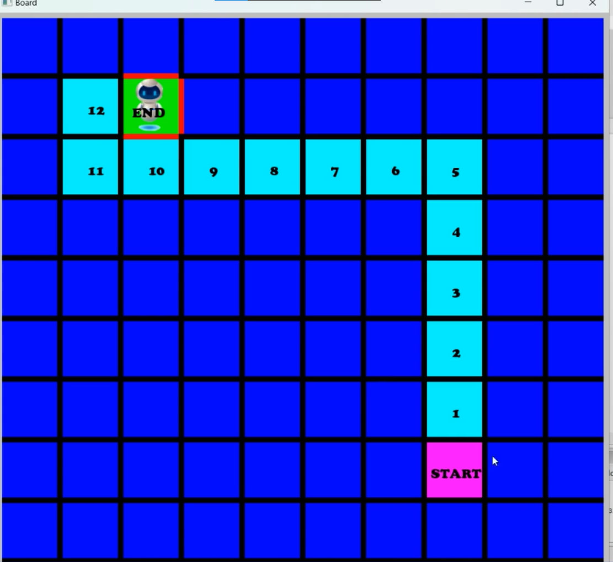

# Maze-solving Visualization

A C++ program for creating a maze board, defining start and end points, adding walls, and visualizing the shortest path using Dijkstra's algorithm.



## Usage

1. Clone the repository:

    ```bash
    git clone https://github.com/AshrafAbdelkhalek10/Maze.git
    ```

2. Build the project:

    ```bash
    g++ -std=c++11 main.cpp -o MazeSolver -lsfml-graphics -lsfml-window -lsfml-system -lsfml-audio
    ```

3. Run the compiled executable:

    ```bash
    ./MazeSolver
    ```

4. Follow the on-screen instructions to input the start and end nodes, add walls, and observe the maze-solving visualization.

## Contributing

Contributions are welcome! If you find any issues or have suggestions for improvements, feel free to open an issue or create a pull request.

## License

This project is licensed under the [MIT License](LICENSE).
